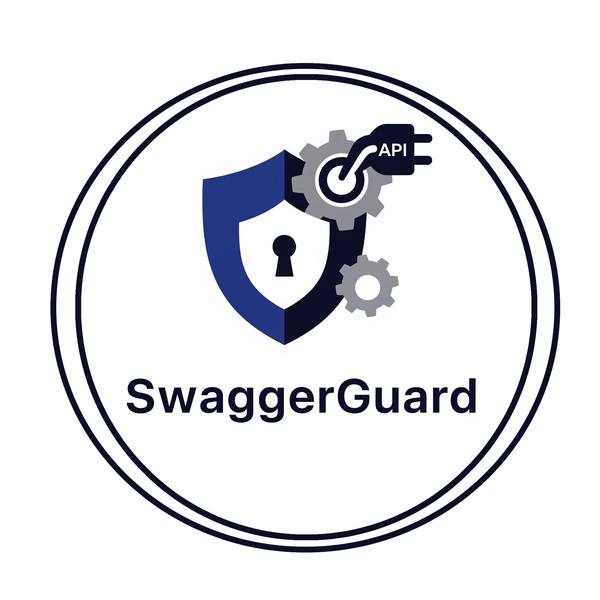
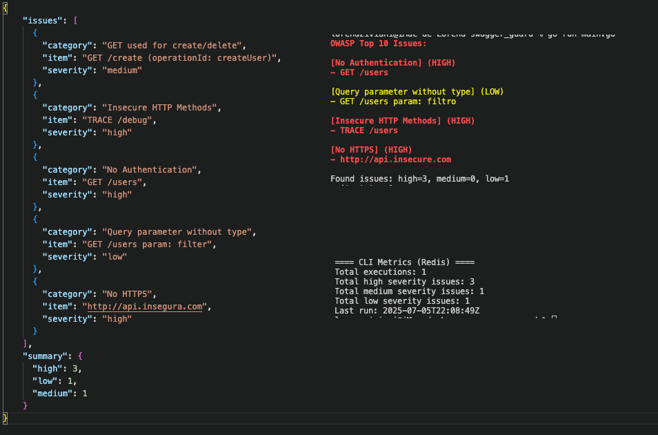

# 🚦 Swagger Guard - Segurança & Auditoria de APIs OpenAPI

<div align="center">


<div data-badges>
  
  
  
</div>

<div data-badges>
  
  
  
  
</div>
</div>

O **Swagger Guard** é um scanner CLI em Go para auditoria automática de segurança de APIs OpenAPI/Swagger, com foco em OWASP Top 10, integração CI/CD, métricas persistentes (Redis) e relatórios customizáveis.

✔️ **Detecção automática de falhas OWASP Top 10**

✔️ **Relatórios CLI, JSON e Markdown**

✔️ **Persistência de métricas em Redis**

✔️ **Pronto para CI/CD, Docker e Compose**

✔️ **Extensível e fácil de integrar**

---

## 🖥️ Como rodar este projeto

### Requisitos:

- [Go 1.21+](https://golang.org/doc/install)
- [Docker & Docker Compose](https://docs.docker.com/get-docker/)
- Redis (local ou via Docker)

### Execução rápida:

1. Clone o repositório:
   ```sh
   git clone https://github.com/lorenaziviani/swagger_guard.git
   cd swagger_guard
   go mod tidy
   ```
2. Configure as variáveis de ambiente:
   ```sh
   cp .env.example .env
   # Edite .env conforme necessário
   ```
3. Suba o Redis (se não tiver):
   ```sh
   docker run -d --name redis -p 6379:6379 redis:7
   ```
4. Rode o scanner:
   ```sh
   ./swagger_guard parse --file api-spec.yaml --output cli
   ```

### Execução com Docker Compose:

```sh
docker-compose up --build
```

---

## ✨ Exemplos de uso e prints

### 1. Análise de API insegura

```sh
./swagger_guard parse --file api-spec.yaml --output cli
```

Saída:

```
OWASP Top 10 Issues:

[No Authentication] (HIGH)
- GET /users

[No HTTPS] (HIGH)
- http://api.insecure.com

[Insecure HTTP Methods] (HIGH)
- TRACE /users

[Query parameter without type] (LOW)
- GET /users param: filtro

Found issues: high=3, medium=0, low=1
```

### 2. Relatório JSON

```sh
./swagger_guard parse --file api-spec.yaml --output json --output-file report.json
cat report.json
```

### 3. Métricas acumuladas

```sh
./swagger_guard parse --metrics
```

Saída:

```
==== CLI Metrics (Redis) ====
Total executions: 5
Total high severity issues: 8
Total medium severity issues: 2
Total low severity issues: 3
Last run: 2025-07-05T18:51:39-03:00
```

### 4. API segura

```
No OWASP Top 10 issues found!
```

---

## 📝 Features do projeto

- 🔒 **Checagem automática OWASP Top 10** (rotas sem autenticação, métodos inseguros, ausência de HTTPS, etc)
- 📊 **Relatórios CLI, JSON, Markdown**
- 🗃️ **Persistência de métricas em Redis**
- 🐳 **Pronto para Docker, Compose e CI/CD**
- 🚦 **Exit code 1 para falhas críticas (ideal para pipelines)**
- 🧩 **Extensível para novas regras e integrações**

---

## ⚙️ Comandos úteis

```sh
# Testes unitários e integração
make test

# Lint
make lint

# Análise de segurança do código
make security

# Build do binário
make build

# Build Docker
make docker

# Executar scanner via Docker Compose
make docker-run-dev

# Visualizar métricas
make metrics
```

---

## 🌐 Variáveis de Ambiente

```env
# .env.example
REDIS_HOST=localhost
REDIS_PORT=6379
LOG_LEVEL=info
OUTPUT_FORMAT=cli
OUTPUT_FILE=
```

---

## 📁 Estrutura de Pastas

```
swagger_guard/
  go.mod
  go.sum
  docker-compose.yml
  Makefile
  .env.example
  cmd/
    root.go
    root_test.go
  docs/
    cli_openapi_parser.drawio
  .gitassets/
    cover.png
```

---

## 🏗️ Arquitetura do Sistema


**Fluxo resumido:**

1. Usuário executa o scanner CLI passando um arquivo OpenAPI/Swagger
2. O parser carrega e valida a especificação
3. As regras OWASP são aplicadas automaticamente
4. Relatórios são gerados (CLI, JSON, Markdown)
5. Métricas são persistidas no Redis
6. Saída e exit code são retornados para uso local ou CI/CD

---

## 🖼️ Exemplos Visuais dos Cenários

### Cenário 1: API Insegura (com falhas OWASP)



- Rotas sem autenticação
- Ausência de HTTPS
- Parâmetro de query sem tipo
- Método inseguro (TRACE)

### Cenário 2: API Segura (sem falhas)


- Todas as rotas protegidas
- Apenas HTTPS
- Parâmetros tipados
- Sem métodos inseguros

---

## 💎 Links úteis

- [Go Documentation](https://golang.org/doc/)
- [Redis](https://redis.io/)
- [Docker](https://www.docker.com/)
- [OWASP Top 10](https://owasp.org/www-project-top-ten/)
- [GitHub Actions](https://docs.github.com/en/actions)

---
